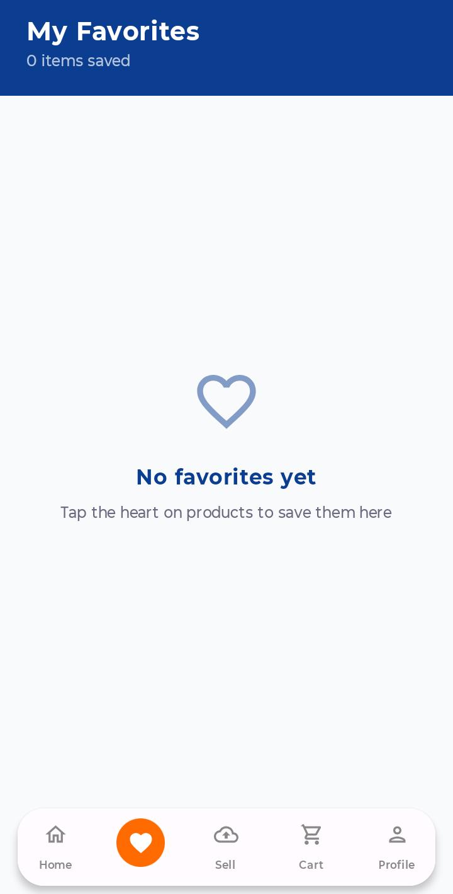
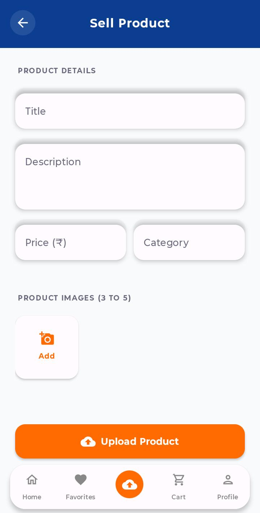
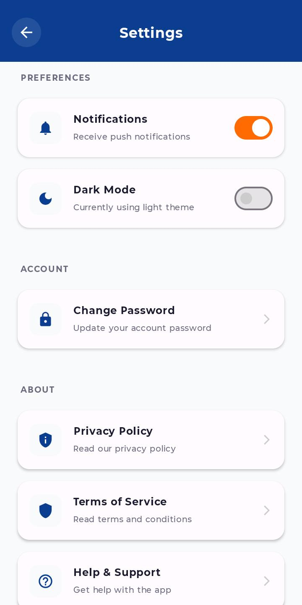

# Zio E-Commerce Android App

A modern, full-featured E-Commerce Android application built with Jetpack Compose, MVVM Architecture, and Firebase. This project was developed as part of a assignment to demonstrate core Android development concepts.

## 🚀 Features

* **User Authentication**: Secure Login and Registration using Firebase Authentication (Email/Password & Google Sign-In).
* **Browse Products**: View a list of products uploaded by various users with a beautiful, responsive UI.
* **Product Details Carousel**: View detailed information about a product, including a swipeable multi-image carousel (`HorizontalPager`) with page indicators and a clickable thumbnail gallery.
* **Sell Products (C2C)**: Users can upload their own products to the platform. Supports uploading 3-5 images per product directly to Cloudinary.
* **Real-Time Refresh System**: Pull-to-refresh indicators across all main screens (Home, Orders, Favorites, Seller Listings, Product Details, Notifications). Live Firestore snapshot listeners update the UI automatically when data changes.
* **Product Review & Rating System**: Permanent reviews stored in Firestore. Uses **Firestore Transactions** to atomically update product ratings and review counts. Includes a "Verified Buyer" check to restrict review creation to actual purchasers, and allows editing existing reviews. Reviews display user names and profile images fetched from the `users` collection.
* **Favorites (Local Storage)**: Users can add products to their favorites list. This list is persisted locally using a Room Database.
* **Admin Dashboard**: (Optional/Separate App) A dedicated Admin application to manage orders, add new products, manage users, and handle upcoming sales.

## 🛠 Tech Stack

* **UI Toolkit**: Jetpack Compose (Modern Declarative UI)
* **Architecture**: MVVM (Model-View-ViewModel)
* **Dependency Injection**: Dagger Hilt
* **Backend as a Service (BaaS)**: Firebase (Auth, Firestore)
* **Local Database**: Room Database
* **Image Upload**: Cloudinary (via OkHttp)
* **Image Loading**: Coil (for Compose)
* **Navigation**: Jetpack Navigation Compose
* **Asynchronous Operations**: Kotlin Coroutines & Flows (including `callbackFlow` snapshot streams)

## 📱 Screenshots

<table width="100%">
  <tr>
    <td align="center" width="33%">
      <b>Home Screen</b><br/>
      
    </td>
    <td align="center" width="33%">
      <b>My Favorites</b><br/>
      
    </td>
    <td align="center" width="33%">
      <b>Shopping Cart</b><br/>
      
    </td>
  </tr>
  <tr>
    <td align="center" width="33%">
      <b>Sell Product</b><br/>
      
    </td>
    <td align="center" width="33%">
      <b>Profile Screen</b><br/>
      
    </td>
    <td align="center" width="33%">
      <b>Settings Screen</b><br/>
      
    </td>
  </tr>
</table>

## ⚙️ How to Run the Project

### Prerequisites
* **Android Studio**: Android Studio Ladybug (or the latest stable version).
* **JDK**: Java 11 or higher.

### Steps to Run
1. **Clone the Repository**:
   ```bash
   git clone <your-github-repo-link>
   ```
2. **Open in Android Studio**:
   * Launch Android Studio.
   * Click on **File -> Open** and select the root directory of this project (`zioo`).
3. **Gradle Sync**:
   * Wait for Gradle to completely sync the project. Make sure you have an active internet connection.
4. **Firebase Configuration**:
   * Ensure the `google-services.json` file is present in the `app/` directory (it is already included).
5. **Run the App**:
   * Connect your Android device via USB (with USB Debugging enabled) OR start an Android Emulator.
   * Click the Green **Play (Run)** button at the top of Android Studio.

## 👥 Contributors
* **Developed By**: krishanvir sindhu
